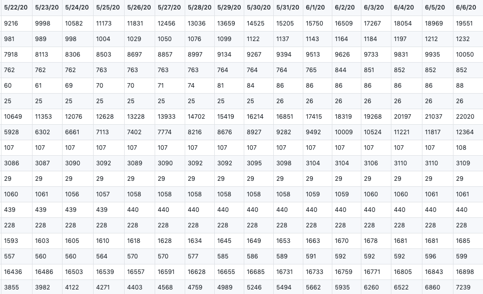
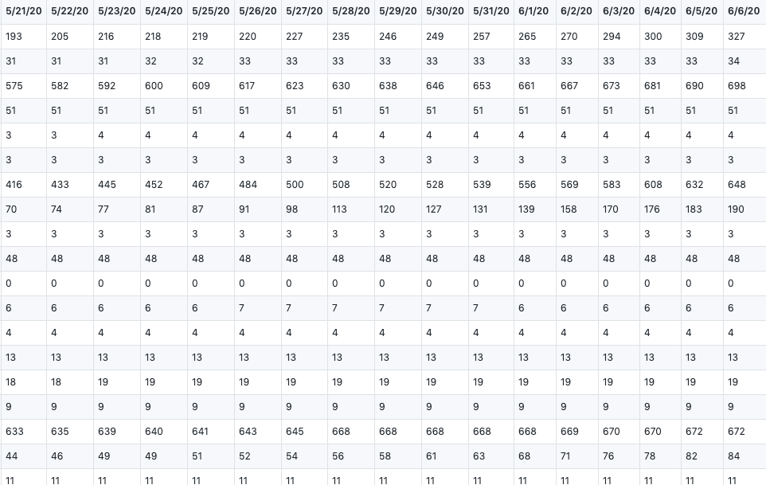
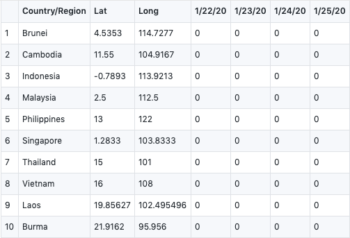
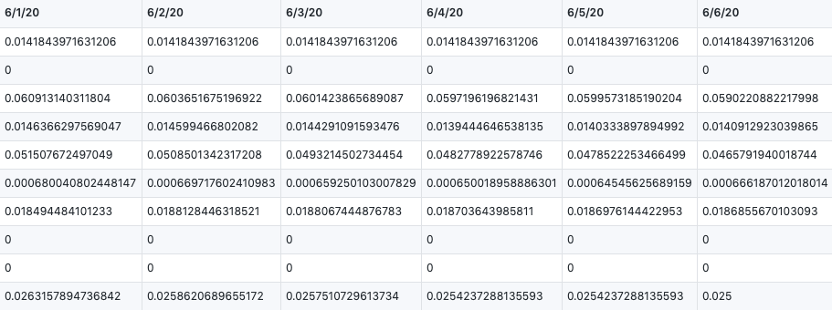
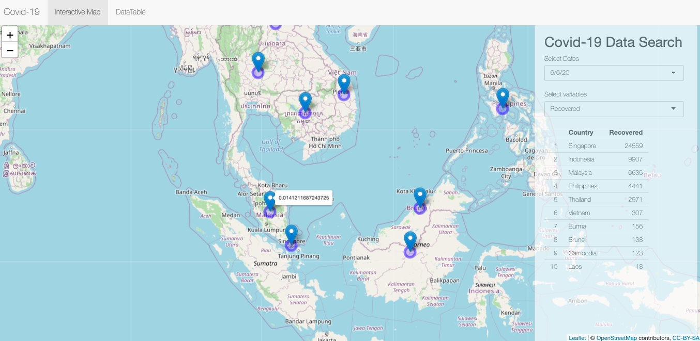

## Covid-19-forecasting-on-ASEAN-countries

  

## Introduction
Since coronavirus (COVID-19) become such a global issue, the way how to forecast it can be essential. For answering this question, it requires us to make use of the ample historical data and processing tools. ASEAN(The Association of Southeast Asian Nations) boasts one of World's most vibrant economies, the fruit of decades of industrial growth and political stability. To counter the virus, ASEAN members already pledged to share information about its spread along with best practices to combat it. In this project, we are going to analyze from the public shared datasets for providing objective forecasts. At the same time, suggesting the planning and decision making for ASEAN.  

## Contributors
Project administration: ZHANG, XIAO 17204147  
Conceptualization: CHEN JIAYUE 17217261   
Data cleansing: ROSHNI MAGAINRAN WIH190021/17206541/1   
Visualization: Nur Anis Nabila bt Mohd Salim WIE180031/17154983/1   
Modeling and Shiny apps: LI KONG 17216250 / ZHANG, XIAO 17204147  

# Data cleansing
We get our two raw datasets from   : <a href="https://github.com/CSSEGISandData/COVID-19/tree/master/archived_data/archived_time_series"> CSSE at Johns Hopkins University</a>  
They showed the total number of global confirmed cases and death cases, which records from 1/22/20 to 6/6/20. 

  

## Global confirmed cases

<a href="https://github.com/xiao11lam/Covid-19_forecasting_on_ASEAN_countries/blob/master/Dataset/time_series_covid19_confirmed_global.csv"> time_series_covid19_confirmed_global.csv</a>  
  

## Global death cases

<a href="https://github.com/xiao11lam/Covid-19_forecasting_on_ASEAN_countries/blob/master/Dataset/time_series_covid19_deaths_global.csv"> time_series_covid19_deaths_global.csv</a>  

  

In this part, we did our data cleansing, we filter the data we have no interest in, only focused on ASEAN member countries. In this way, we can calculate the [Case Fatality Rate]("https://en.wikipedia.org/wiki/Case_fatality_rate") by confiremed cases dividing death cases. Here is our result:  

<a href="https://github.com/xiao11lam/Covid-19_forecasting_on_ASEAN_countries/blob/master/Dataset/case_fatality.csv"> case_fatality.csv</a>  

 

  

# Data Visualization 
  
  
  
  
  
  

# Modeling
For our exploration, we use  <a href="https://en.wikipedia.org/wiki/Long_short-term_memory"> LSTM</a> model to do forecastings. The forecasting results is based on the previous ending date the one-day after. 

  

And here are the results. 
<a href="https://github.com/xiao11lam/Covid-19_forecasting_on_ASEAN_countries/blob/master/Dataset/pre.csv"> pre.csv
</a>  

  

# Shiny Apps
Here is the Shiny Apps we lauch. 

<a href="https://likong.shinyapps.io/Covid-19/"> Covid-19 forecasting on ASEAN countries Shiny App</a> 
  

# Reference
https://ornlcda.github.io/icons2018/presentations/comparison_reynolds.pdf  
https://www.datanovia.com/en/blog/ggplot-title-subtitle-and-caption/#center-the-title-position  
http://www.sthda.com/english/articles/32-r-graphics-essentials/128-plot-time-series-data-using-ggplot/  

